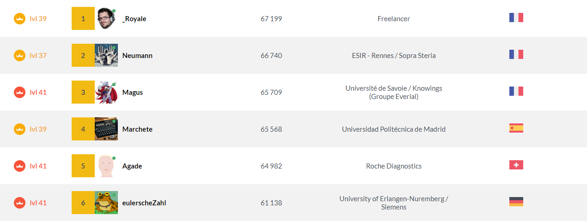

# Exploration of Ranking in CodinGame

## Introduction

Being an active Condingame user but not so often currently, I remarked that I still have a "correct" position in the Leaderborad. Being learning Data Science with Python and R, I decided to do a exploration of the ranking. To do so, the ranking has been scrapped from the [website](https://www.codingame.com/leaderboards/global) in Python and saved as a Dataset. Only the first 303118 player have been extracted as the scrapping time is quite long (We need more than 30h to query the full datas due to the response time of the ranking API).

Another drawback of the current Leaderboard is the ranking %. As soon as you succeed to finish few simple puzzle for example, you already are in top 1% which is completely biaised.

This Notebook will dig a big in the current leaderboard and try to find another way to rank player.

## Loading datas

```{r message = FALSE, warning = FALSE, error = FALSE}
library(readr)
library(ggplot2)
library(dplyr)
library(tidyr)
library(scales)

ranking_global <- read_csv("ranking_global.csv")
```


Let first take a look at the head and the tail of the dataset
```{r}
head(ranking_global, 20)
tail(ranking_global, 20)
```

As we can see, we have the score provided :

* by achievements
* With Clash Of Code
* During Contest
* With Multiplayer Puzzles
* with Optimization puzzles
* the XP won (used for level)
* the score (used for ranking) = clash + codegolf + contest + multiTraining + optim

We also have: 

* the ranking
* the pseudo
* profile hash
* country

We can see that the API provides more information that the Leaderboard as we can modify the LeaderBord based on option like a specific country



First, let's extract the ranking I had while I've extracted datas

```{r echo = FALSE, warning = FALSE, error = FALSE}
ranking_global <- ranking_global %>%
                    mutate(cumsum_score = cumsum(score)) %>%
                    mutate(xp = xp-75) %>%
                    mutate(cumsum_xp = cumsum(xp))
ranking_global_pos <- filter(ranking_global, score > 0)
positive_score <- nrow(ranking_global)

tidy_df = ranking_global %>%
          gather("mode", "pts", c("clash", "codegolf", "contests", "multiTraining", "optim")) %>%
          subset(select = c("countryId", "level", "rank", "userId", "xp", "mode", "pts", "achievements", "score"))

confusion <- as.data.frame(table(ranking_global$xp > 75, ranking_global$score > 0))

confusion2 = data.frame(confusion)
confusion2$Freq[(confusion2$Var1 == FALSE) & (confusion2$Var2 == FALSE)] <- confusion2$Freq[(confusion2$Var1 == FALSE) & (confusion2$Var2 == FALSE)] + 750000

top_country_number = ranking_global %>%
                      filter(countryId != "?") %>%
                      group_by(countryId) %>%
                      summarise(count = n()) %>%
                      # filter(count > 2000)
                      arrange(desc(count)) 
list_country_number = c(top_country_number$countryId)[1:20]

top_country_global <- ranking_global %>%
                      filter(countryId != "?") %>%
                      group_by(countryId) %>%
                      summarise(
                        count = n(),
                        score_avg = mean(score),
                        xp_avg = mean(xp)) # %>%
                      #filter(count > 2000) %>%
                      #arrange(desc(mean)) 
list_country_global = c(top_country_global$countryId)[1:20]

me = filter(ranking_global, profile == "de015f1a510d60cdcd0551896a34c709188072")
me_tidy = me %>%
          gather("mode", "pts", c("clash", "codegolf", "contests", "multiTraining", "optim")) %>%
          subset(select = c("countryId", "level", "rank", "userId", "xp", "mode", "pts", "achievements"))
```

## Exploration

#### Balance of Score/XP

On Codingame there is 2 main ranking : the ranking based on "Score" which is releated to your participations in multiplayer games and the XP which is related to the XP won throught puzzles and achievements.

As we can see on the tail of the dataset, nearly all people reach 75 XP as it's only the beginning and only a Copy-Paste to the first puzzle is enought. What we can take a look is the number of account having either 0 in score or below 75 XP

```{r}
ggplot(confusion, aes(x = Var1, y = Var2)) +
  geom_tile(aes(fill = Freq), colour = "white") +
  geom_text(aes(label = sprintf("%1.0f", Freq)), vjust = 1) +
  scale_fill_gradient(low = "#8AC5FF", high = "#224970") +
  theme_bw() + 
  scale_x_discrete(labels=c("XP<=75", "XP>75")) +
  scale_y_discrete(labels=c("Score=0", "Score>0")) +
  ggtitle("Balance of Players based on Score and XP (without complete dataset)") +
  theme(legend.position = "none",
        axis.text.x = element_text(face="bold", size=14),
        axis.text.y = element_text(face="bold", size=14),
        axis.title.x = element_blank(),
        axis.title.y = element_blank(),
        plot.title = element_text(hjust = 0.5))

```
As mentionned previously, I don't have the full dataset. I stopped at page 3000 and there is more than 10 000 now. Nearly all following accounts in the ranking would be in the bucket (Score = 0 & XP < 75) leading to a Matrix like :

```{r}
ggplot(confusion2, aes(x = Var1, y = Var2)) +
  geom_tile(aes(fill = Freq), colour = "white") +
  geom_text(aes(label = sprintf("%1.0f", Freq)), vjust = 1) +
  scale_fill_gradient(low = "#8AC5FF", high = "#224970") +
  theme_bw() + 
  scale_x_discrete(labels=c("XP<=75", "XP>75")) +
  scale_y_discrete(labels=c("Score=0", "Score>0")) +
  ggtitle("Balance of Players based on Score and XP (with complete dataset)") +
  theme(legend.position = "none",
        axis.text.x = element_text(face="bold", size=14),
        axis.text.y = element_text(face="bold", size=14),
        axis.title.x = element_blank(),
        axis.title.y = element_blank(),
        plot.title = element_text(hjust = 0.5))

```
Now we can see that there is a lot of account who surrender directly at the begining. Nevertheless, they are still counted for our ranking making active player very early in the top 1%. For example, if you only consider score, as soon as you have a positive score you are in the top 74 180 / 1 053 118 (leading to a top 7% ... not bad but not realistic). With the same exercice but on XP side, with 100 XP, you don't climb as fast as a lot of people succeed to be above 100XP (tmore details will come about that later), but you can still be top 27%.

#### Countries

We can also take a look at best countries. To do so, we can plot the number of member and the average Score or XP

```{r}
top_country_global %>%
  filter(count > 2000) %>%
  gather("mode", "pts", c("score_avg", "xp_avg")) %>%
  ggplot(., aes(x=count, y=pts, label=countryId, col=countryId)) + 
    geom_point() +
    geom_text(aes(label=countryId),hjust=-0.25, vjust=0.5) +
    scale_x_log10(breaks = c(2500, 5000, 10000, 20000, 40000)) + 
    facet_grid(mode ~ ., scales = "free_y") +
    ggtitle("Balance of Players based on Score and XP (with complete dataset)") +
    labs(x = "Number of Accounts", y="Pts or XP") +
    theme(legend.position="none")
```
We can see that France and USA are the main source of players. In term of Score or XP, France is highly above USA in average. In term of "efficiency", Japan, Russia, Germany, Switzerland and Hungary are also quite good but with a lot less players (pay attention that X_scale is logarithmic too).

#### Balance of Scores/XP

Now let's look more in details about Scores and XP. to do so, we have access the the ranking of peoples. We can use it too look at the "balance"" of it. Due to the variation of the score and XP with the ranking, it has been converted too with log10.

```{r warning = FALSE, error = FALSE}
ggplot(ranking_global, aes(x=rank)) + 
    geom_line(aes(y=log10(score), colour="log(Score)")) + 
    geom_smooth(aes(y=log10(xp-75), colour="log(XP)")) + 
    ggtitle("Score and XP based on rank") +
    theme(plot.title = element_text(hjust = 0.5))
```
We can see that their is a huge disparity of Xp based on the rank. This can be understood as most difficult puzzle for example brings more XP than usual and are solved only by best coders usually on top also of Tournaments. Another way to classify that is to look at Cumulative Sum

```{r}
max_cum_score <- max(ranking_global$cumsum_score)


ranking_global %>%
  filter(rank < 73000) %>%
  ggplot(., aes(x=rank)) + 
      geom_line(aes(y = cumsum_score, colour="Cumulative Score")) + 
      geom_line(aes(y = cumsum_xp, colour="Cumulative XP")) + 
      geom_hline(aes( yintercept=max_cum_score * 0.95, linetype = "95% of total Cumulated Score"), colour='orange') + 
      geom_vline(aes( xintercept=21000, linetype="95% of total Cumulated Score" ), colour='orange') + 
      ggtitle("Cumulative Score based on the ranking") +
      scale_linetype_manual(name = "limit", values = c(2, 2)) +
      labs(y = "Cumulative Score/XP")+
      theme(plot.title = element_text(hjust = 0.5))
```
From this plot, we can see that after the 35.000th rank, the score is nearly static even if there is more player at every rank (this is visible with steps on cumulative XP). We can also see that the 21.000 th first rank cumulate 95% of the total score on the website. This can be a good trigger for a new ranking system.

Last thing we can do with those values is to look at the distribution. 
```{r warning = FALSE, error = FALSE}
ranking_global %>%
  gather("mode", "pts", c("score", "xp")) %>%
  ggplot(., aes(x=log(pts), col=mode)) + 
    geom_density() + 
    ggtitle("Distribution of the Score or XP") + 
    facet_grid(mode ~ . , scale="free_y") +
    theme(plot.title = element_text(hjust = 0.5))
```
We can see "waves" in XP distribution. This is related to "learning" state. For example, as soon as you know how to handle graphes properly, you can solve a bunch of puzzle (meaning going throught the hollow of the wave). Then you will be stuck as you have to know how to handle something else and so on. Regarding Score, this is more balanced.

#### Analysis by level

With this dataset, we can also take a look at the score compare to level (equivalent to Xp but with discrete values). Fisrt thing we can do is to look at boxplots by level.

```{r}
ranking_global %>%
      ggplot(., aes(x=factor(level), y=score, col = factor(level))) + 
      geom_boxplot(show.legend=F) + 
      geom_hline(aes(yintercept = 10000, linetype = "Higher score of lvl 5-10"), colour='red') + 
      ggtitle("Distribution of the Score based on the level") +
      theme(legend.position="bottom",
            plot.title = element_text(hjust = 0.5)) +
      scale_linetype_manual(name = "limit", values = c(2, 2)) +
      labs(x="level")
```
We can see that some players are not focusing at all on level but only on multiplayer challenges. For example, there is account level 5 to 10 with more score than 50 % of player level 24. In the other hand, we also have player level 31-32 below best player level 2-3. More simple, we can also look at the proportion of player with a score = 0 or not based on levels.

```{r}
ranking_global %>%
      mutate(pos = score > 0) %>%
      ggplot(., aes(x = level, fill = pos)) + 
      geom_bar() + 
      ggtitle("Number of player having a score > 0 by level") + 
      theme(plot.title = element_text(hjust = 0.5))
```
And the same but only showing proportions
```{r}
ranking_global %>%
      mutate(positive_score = score > 0) %>%
      group_by(level, positive_score) %>%
      summarise(c = n()) %>%
      ggplot(., aes(x = level, y=c, fill = positive_score)) + 
        geom_bar(position = "fill", stat = "identity") + 
        ggtitle("Proportion of player having a score > 0 by level") + 
        scale_y_continuous(labels = percent_format()) +
        theme(plot.title = element_text(hjust = 0.5),
              axis.title.y = element_blank())
```
Up to level 10, most of player are not joining multiplayer challenges probably as they are learning things first in puzzles. The last thing we didn't checked yet is the balance between mode in multiplayer challenges. Let's now explore it.

#### Modes

For all player having a score positive, let's check what are the balance of points provided. Again for scaling reasons, the y scale is logarithmic.

```{r}
tidy_df %>%
  filter(pts>0) %>%
  ggplot(., aes(x=mode, y=pts, col = mode)) + 
    geom_boxplot() + 
    scale_y_continuous(trans = 'log10', breaks = c(1, 10, 100, 1000, 10000, 100000)) +
    ggtitle("Distribution of the Score based on the mode") +
    theme(plot.title = element_text(hjust = 0.5),
          legend.position = "none",
          axis.title.x = element_blank()
          )
```

As we could imagine, contest and multiTraining are the best options to climb in the ranking. They provides more points than other competitions. Nevertheless, some other competitions are quite simple to do at first step and doesn't require lot of time (for example CoC or codegolf). In the case of CoC, we can easily have more 500-1000 points in few games. It's not a part to ignore to get easy points.

Now if we look at density of points for every mode with all player having a score > 0 (meaning that the sum of multiplayer challenges is > 0, and not every mode > 0), we have the following density (with a log scale x).

```{r}
tidy_df %>%
  filter(score>0) %>%
  ggplot(., aes(x=log10(pts+1), col=mode)) + 
    geom_density() + 
    ggtitle("Distribution score by mode") +
    theme(plot.title = element_text(hjust = 0.5))
```
We can see that the density is very high at 0 score. So to have a proper density, we will filter all mode with 0:

```{r}
tidy_df %>%
  filter(pts>0) %>%
  ggplot(., aes(x=log10(pts+1), col=mode)) + 
    geom_density() + 
    ggtitle("Distribution score by mode") +
    theme(plot.title = element_text(hjust = 0.5))
```
What we see here is a quite balance of people in all section except optimisation as it is based on a ranking. For optimisation, we have a huge peak at around 70 pts. This means that lot of player are stuck at the same moment or with the same score. 

For all players with a positive score, let's now take a look a the proportion of players who play to a specific mode.

```{r}
tidy_df %>%
  filter(score > 0) %>%
  mutate(positive_score = pts>0) %>%
  group_by(mode, positive_score) %>%
  summarise(c = n()) %>%
  ggplot(., aes(x = mode, y=c, fill = positive_score)) + 
    geom_bar(position = "fill", stat = "identity") + 
    ggtitle("Proportion of player having a score > 0 by mode") + 
    scale_y_continuous(labels = percent_format()) +
    theme(plot.title = element_text(hjust = 0.5),
          axis.title.y = element_blank(),
          axis.title.x = element_blank())
```
More than 90% of player doesn't play CoC for example. As a result, it's again more easier to get the points as you are in competition only vs. few peoples. In opposite, around 70% already played in a multiTraining. The strange point is that 70% of players never took place in a  competition. This is higher as what we can expect.

To finish, a final visualization which can be helpfull is to group players by rank (in the following case by bucket of 100) and plot the average score in every categories.With this, we have:
```{r}
tidy_df %>%
  mutate(group = rank %/% 100) %>%
  filter(group < 100) %>%
  group_by(group, mode) %>%
  summarize(pts = mean(pts)+1) %>%
  ggplot(., aes(x=group, y=pts)) + 
    geom_area(aes(x=group, y=pts, group = mode, fill=mode),color="black", alpha=0.4)
```

This highlight a lot the fact that top player get their score mainly with contest and multiTraining.

Now we have a better overview, we have some clue on how to climb in the ranking based on score. First one is to do CoC, as it is fast and easy points. Then, optimisation is also a quick way to get points as it's often simple puzzle so a solution can be found in a small amount of time. To finish, the best remains multiTraining when there is no contest and Contest when it's avaialable. They takes lot of time but provides also more points. Before to finish, let's take a look at where a specific player is positionned (in this example, me :D).

## Specific player

A good way to know where you are is to position yourseft per mode with the N player in front of you. In the following case, I used 1.000.

```{r warning = FALSE}
y_me = c(me["clash"][[1]], me["codegolf"][[1]], me["contests"][[1]], me["multiTraining"][[1]], me["optim"][[1]])
x_me = c(1:5)
rank_me = me["rank"][[1]]
diff = 1000

tidy_df %>% 
    filter(rank <rank_me, rank > rank_me - diff) %>%
    ggplot(., aes(x=mode, y=pts, col=mode)) + 
    geom_boxplot() + 
    annotate("point", x = c(1:5), y = y_me, colour = "red") + 
    scale_y_continuous(trans = 'log10', breaks = c(1, 10, 100, 1000, 10000, 100000)) +
    ggtitle("My position compare to the 1000 player above me") + 
    theme_bw() +
    theme(plot.title = element_text(hjust = 0.5),
          axis.title.x = element_blank(),
          legend.position = "none")
```

Now I know that if I want to climb, I have to focus on contests and multiTraining. This is understandable as I didn't participate a lot within the last year...

## Conclusion

In this Notebook, my objective was to discover R and explore a simple dataset. We succeed to analyse where we try to get some points and climb in the ranking. 

We can also conclude that the current ranking is quite biaised. There is plenty of inactive accounts which should not be considered. A good containment would be to only consider account with a positive score in the expected section. For example, if we want the ranking based on the Score, we will be against 73 000 player instead of more than a million. This is also true when we want only to compare player in a specific section.

Regarding the strategy, the first step to increase the score is to work on CoC and codegolf. After that, the main option is to focus on multiTraining when there is no contest. This allows an important boost of points if the result is good (but this require a lot more time). It's a tradeoff to evaluate.


